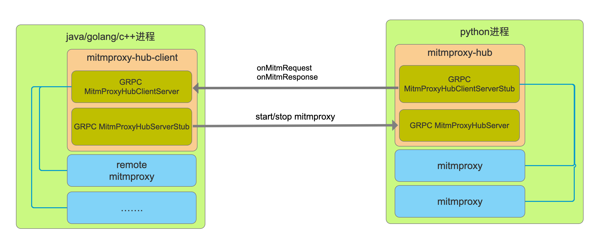

# java版mitmproxy-java

https://github.com/CreditTone/mitmproxy-java

[mitmproxy](https://github.com/mitmproxy/mitmproxy)作为一款出色中间人攻击工具，它在渗透、爬虫、ajax-hook、抓包等场景中表现的相当稳定和出色。但由于原生项目是python的缘故，使得跨语言使用mitmproxy显的非常吃力。经常借助于中间件或单独开发http服务来于mitmproxy进行通信。为此[mitmproxy-java](https://github.com/CreditTone/mitmproxy-java)基于[mitmproxy-hub](https://github.com/CreditTone/mitmproxy-hub "mitmproxy-hub")实现了java版mitmproxy客户端。你可以像使用原生[mitmproxy](https://github.com/mitmproxy/mitmproxy)一样使用它。

### 原理介绍
[mitmproxy-hub](https://github.com/CreditTone/mitmproxy-hub "mitmproxy-hub")定义了其他任何语言可以生成的proto3序列化代码，借助于grpc高效的跨进程通信。使得其他语言可以对mitmproxy内部的流量进行无死角的监控。



### 为什么不直接使用browsermob-proxy、LittleProxy等java原生语言开发的mitm代理？
browsermob-proxy/LittleProxy对于高并发场景下的表现十分不稳定，而且在大文件传输上经常有内存溢出现象。主要是因为两个项目的作者均已在3年前就已经停止更新。本人猜想也许是看到mitmproxy太过于强大，没有继续发展下去的希望。就像google headless一出来phantomjs作者就停止更新一样。而mitmproxy在开源社区一直是高活跃项目，bug等问题修复及时。借用grpc远程控制mitmproxy是一种站在巨人的肩膀上的方法。

### MitmproxyFlowCallBackServer 
mitmproxy通过grpc回调回来的flows是通过MitmproxyFlowCallBackServer启动的grpc server来回调的。MitmproxyFlowCallBackServer.getInstance()可获取默认实例。当然你也可以通过public MitmproxyFlowCallBackServer(int port)构造方法创建自定义端口的实例，但请注意维护好其生命周期。


### 推荐环境
```
Mitmproxy: 5.3.0
Python:    3.6.8
OpenSSL:   OpenSSL 1.1.1h  22 Sep 2020
Platform:  Darwin-20.1.0-x86_64-i386-64bit
```

### 启动mitmproxy-hub
```
git clone https://github.com/CreditTone/mitmproxy-hub.git
cd mitmproxy-hub
python3 server.py //server on port 60051

```

### maven集成mitmproxy-java
```xml
<dependency>
  <groupId>com.deep007</groupId>
  <artifactId>mitmproxy-java</artifactId>
  <version>1.0.7</version>
</dependency>
```

### 启动一个remote mitmproxy

> RemoteMitmproxy构造方法一共3个，源码如下

```java
	/**
	 * 启动一个Remote Mitmproxy 
	 * @param mitmproxyHubAddr mitmproxy-hub服务的ip，不知道mitmproxy-hub是什么请看https://github.com/CreditTone/mitmproxy-hub
	 * @param mitmproxyHubPort mitmproxy-hub服务的端口 
	 * @param remoteBind       在mitmproxy-hub这个机器上启动一个mitmproxy实例，告诉它需要绑定的IP。如果是本机的话绑定127.0.0.1即可，如果不是本机绑定0.0.0.0。并在使用的时候注意本机到mitmproxy-hub服务的IP关系。相信稍微有点网络知识不必我再说了吧
	 * @param remoteBindPort   在mitmproxy-hub这个机器上启动一个mitmproxy实例，告诉它需要绑定的端口
	 */
	public RemoteMitmproxy(String mitmproxyHubAddr, int mitmproxyHubPort, String remoteBind, int remoteBindPort) {
		this(mitmproxyHubAddr, mitmproxyHubPort, remoteBind, remoteBindPort, null, null);
	}
	
	/**
	 * 启动一个Remote Mitmproxy
	 * @param mitmproxyHubAddr 
	 * @param mitmproxyHubPort
	 * @param remoteBind
	 * @param remoteBindPort
	 * @param upstream  启动远端mitmproxy实例的同时设置一个上游的http代理 格式如:http://http-dyn.abuyun.com:9020、http://192.168.0.101:8080。类似命令：mitmdump --mode upstream:http://192.168.0.101:8080，还不了解自己去了解https://docs.mitmproxy.org/archive/v5/concepts-modes/#upstream-proxy
	 */
	public RemoteMitmproxy(String mitmproxyHubAddr, int mitmproxyHubPort, String remoteBind, int remoteBindPort, String upstream) {
		this(mitmproxyHubAddr, mitmproxyHubPort, remoteBind, remoteBindPort, upstream, null);
	}
	
	/**
	 * 例如：RemoteMitmproxy remoteMitmproxy = new RemoteMitmproxy("127.0.0.1", 60051, "127.0.0.1", 8866, "http://http-dyn.abuyun.com:9020", "H889CWY00SVY012D:263445C168FAE095");
	 * 
	 * @param mitmproxyHubAddr
	 * @param mitmproxyHubPort
	 * @param remoteBind
	 * @param remoteBindPort
	 * @param upstream  启动远端mitmproxy实例的同时设置一个上游的http代理 格式如:http://http-dyn.abuyun.com:9020、http://192.168.0.101:8080
	 * @param upstreamAuth  如果上游的http代理有验证，则设置。 格式：H889CWY00SVY012D:263445C168FAE095
	 */
	public RemoteMitmproxy(String mitmproxyHubAddr, int mitmproxyHubPort, String remoteBind, int remoteBindPort, String upstream, String upstreamAuth) {
		this.mitmproxyHubAddr = mitmproxyHubAddr;
		this.mitmproxyHubPort = mitmproxyHubPort;
		this.remoteBind = remoteBind;
		this.remoteBindPort = remoteBindPort;
		this.upstream = upstream;
		this.upstreamAuth = upstreamAuth;
	}
```

### 监控网络流量
```java
public static void main(String[] args) throws InterruptedException {
		RemoteMitmproxy remoteMitmproxy = new RemoteMitmproxy("127.0.0.1", 60051, "127.0.0.1", 8866);
		remoteMitmproxy.addFlowFilter(new FlowFilter() {
			
			@Override
			public void filterRequest(FlowRequest flowRequest) {
				System.out.println(flowRequest.getUrl());
			}
			
			@Override
			public void filterResponse(FlowResponse flowResponse) {
				FlowRequest flowRequest = flowResponse.getRequest();
				System.out.println(flowRequest.getUrl() + " response length:" +flowResponse.getContent().length);
			}
			
		});
		remoteMitmproxy.start();
		Thread.sleep(1000 * 60 * 5);
		remoteMitmproxy.stop();
}
```

### 篡改网络响应
```java
public static void main(String[] args) throws InterruptedException {
		RemoteMitmproxy remoteMitmproxy = new RemoteMitmproxy("127.0.0.1", 60051, "127.0.0.1", 8866);
		remoteMitmproxy.addFlowFilter(new FlowFilter() {
			
			@Override
			public void filterRequest(FlowRequest flowRequest) {
			}
			
			@Override
			public void filterResponse(FlowResponse flowResponse) {
				FlowRequest flowRequest = flowResponse.getRequest();
				if (flowRequest.getUrl().startsWith("https://www.baidu.com")) {
					flowResponse.setContentAsString("就不让你访问百度，哈哈!");
				}
			}
			
		});
		remoteMitmproxy.start();
		Thread.sleep(1000 * 60 * 5);
		remoteMitmproxy.stop();
}
```


### 劫持cookie
```java
public static void main(String[] args) throws InterruptedException {
		RemoteMitmproxy remoteMitmproxy = new RemoteMitmproxy("127.0.0.1", 60051, "127.0.0.1", 8866);
		CookieCollectFilter cookieCollectFilter = new CookieCollectFilter();
		remoteMitmproxy.addFlowFilter(cookieCollectFilter);
		remoteMitmproxy.start();
	    Thread.sleep(1000 * 60 * 5);
	    remoteMitmproxy.stop();
	    for (Cookie cookie : cookieCollectFilter.catchCookies) {
	    	System.out.println(cookie.getDomain() + ">>>"+ cookie.getName()+"="+cookie.getValue() +" path:"+cookie.getPath());
	    }
}
```

#### 有问题请留言谢谢！

